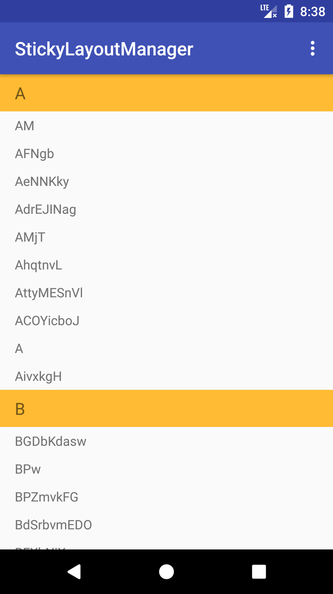
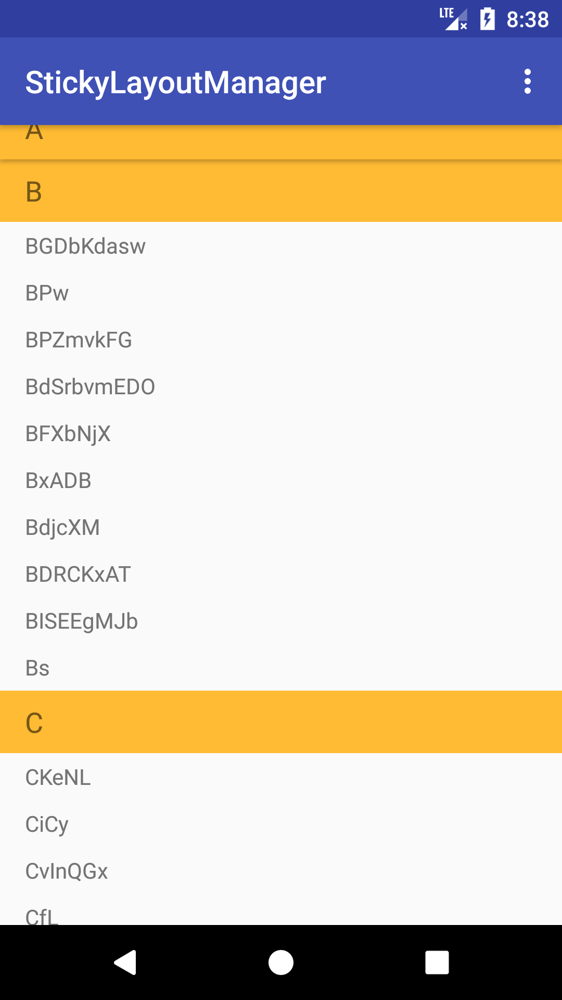
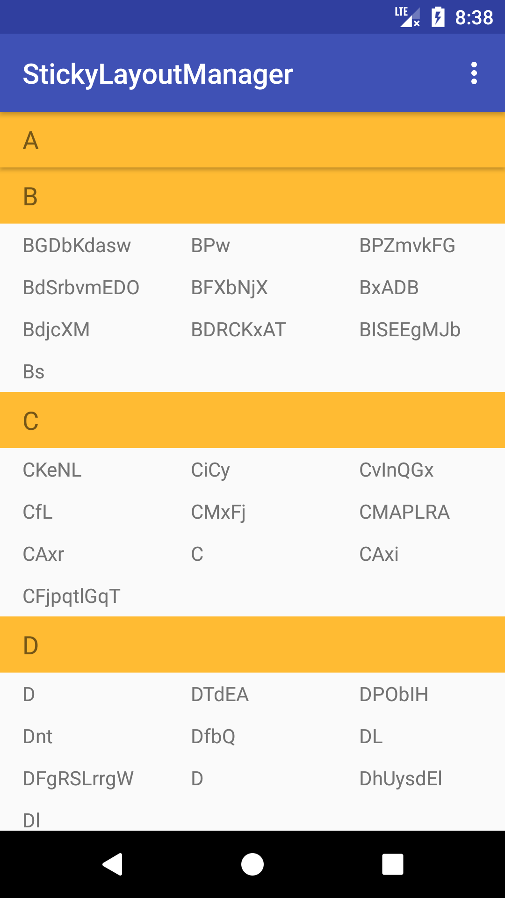

[](https://jitpack.io/#qiujayen/sticky-layoutmanager)


# Sticky-LayoutManager
An android recyclerView sticky item view layout manager library

|Image|Image|Image|
|:-:|:-:|:-:|
||||

## Download Demo Apk
|[apk](apk/app-debug.apk)|
|:-:|
||

## How to
### Step 1. Add the JitPack repository to your build file
Add it in your root build.gradle at the end of repositories:
```groovy
allprojects {
	repositories {
		...
		maven { url 'https://jitpack.io' }
	}
}
```

### Step 2. Add the dependency
```groovy
dependencies {
	implementation 'com.github.qiujayen:sticky-layoutmanager:last-version'
}
```
### This library dependencies
```groovy
implementation 'com.android.support:recyclerview-v7:version code'
```

## How to use StickyLayoutManager?
```java
class RecyclerView.Adapter implements StickyHeaders {
  public boolean isStickyHeader(int position) {
    // Implement this method
  }
}
```
```java
RecyclerView.setLayoutManager(new StickyHeaders...xxx...LayoutManager<RecyclerView.Adapter & StickyHeaders>());
```

## Thanks
This library is inspired by , and use it to the source code for the implementation of the other two layoutmanager.

## License
Copyright 2017 QiuJay Inc.

Licensed under the Apache License, Version 2.0 (the "License");
you may not use this file except in compliance with the License.
You may obtain a copy of the License at

   http://www.apache.org/licenses/LICENSE-2.0

Unless required by applicable law or agreed to in writing, software
distributed under the License is distributed on an "AS IS" BASIS,
WITHOUT WARRANTIES OR CONDITIONS OF ANY KIND, either express or implied.
See the License for the specific language governing permissions and
limitations under the License.
